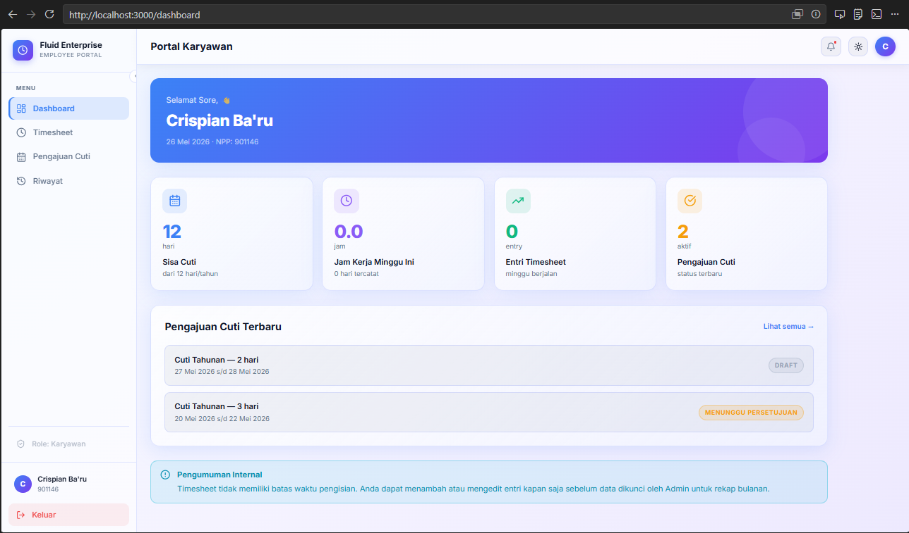
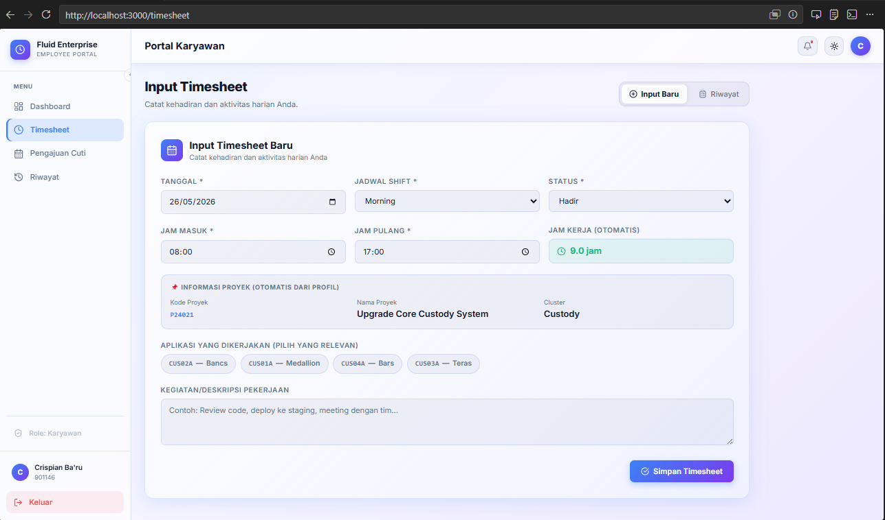
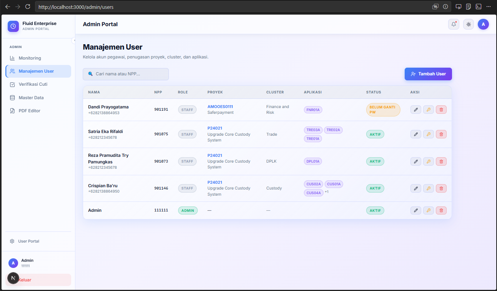
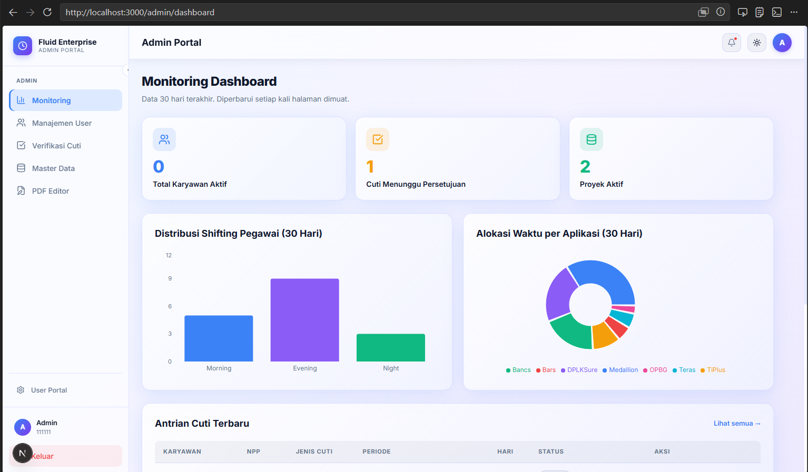

# Fluid Enterprise

**Sistem Manajemen Timesheet & Cuti Hibrida**

Sebuah aplikasi web Next.js untuk manajemen timesheet, cuti, serta kontrol admin berbasis Supabase. Aplikasi ini menyediakan portal karyawan dan portal admin lengkap dengan monitoring, manajemen user, export laporan, dan editor template PDF.

---

## Fitur Utama

### Portal Karyawan
- Input timesheet harian dengan tanggal, shift, status, jam masuk/pulang, dan deskripsi pekerjaan.
- Tab Riwayat timesheet untuk melihat catatan aktivitas sebelumnya.
- Export data timesheet pribadi ke format `.xlsx` atau `.pdf`.
- Menu pengajuan cuti dengan status permintaan dan informasi terbaru.
- Wajib ganti password untuk akun baru saat login pertama.

### Portal Admin
- Manajemen user lengkap: tambah user, lihat detail, dan reset password.
- Monitoring dashboard untuk melihat ringkasan aktifitas user, cuti, serta alokasi waktu per aplikasi.
- Export timesheet multi-user dalam format `.xlsx` atau `.pdf`.
- PDF template editor untuk mengunggah template mentah dan memetakan koordinat field dinamis.

### Arsitektur & Integrasi
- Next.js 15 dengan App Router dan React Server Components (RSC).
- Tailwind CSS untuk styling modern dan responsif.
- Supabase Auth untuk autentikasi email/password dan RLS untuk kontrol akses.
- `pdf-lib` untuk pemrosesan dokumen PDF dan `exceljs`/`xlsx` untuk export spreadsheet.

---

## Komponen Utama

### Database
- `profiles`, `timesheets`, `leave_requests`, `pdf_templates`, `projects`, `clusters`, `applications`.
- Relasi 1-to-1 antara `auth.users` dan `public.profiles`.
- RLS memastikan user hanya mengakses data miliknya, sedangkan admin dapat akses penuh.

### Halaman
- `/dashboard` – ringkasan portal karyawan.
- `/timesheet` – input timesheet dan riwayat.
- `/leave` – form pengajuan cuti.
- `/history` – daftar riwayat cuti dan timesheet.
- `/admin/dashboard` – monitoring admin.
- `/admin/users` – manajemen pengguna.
- `/admin/pdf-editor` – editor template PDF.

---

## Instalasi & Jalankan

1. Pasang dependency:

```bash
npm install
```

2. Jalankan server development:

```bash
npm run dev
```

3. Buka `http://localhost:3000`

4. Konfigurasi environment Supabase pada `.env.local` sesuai kebutuhan.

---

## Dokumentasi Visual

### Dashboard Karyawan


### Input Timesheet


### Manajemen User Admin


### Monitoring Dashboard Admin


---

## Struktur Folder Penting

- `app/` – halaman dan layout Next.js.
- `components/` – komponen UI reusable untuk portal user dan admin.
- `lib/supabase/` – konfigurasi client dan middleware Supabase.
- `actions/` – fungsi server untuk operasi timesheet, leave, auth, dan PDF.
- `public/` – aset statis.
- `supabase/migrations/` – skrip database.

---

## Catatan

Dokumentasi ini memuat ringkasan fungsi aplikasi sesuai PRD V1.2, termasuk kontrol admin, export data, dan editor template PDF. Untuk pengembangan lebih lanjut, fokus pada manajemen data master, keamanan RLS, serta peningkatan UX pada editor PDF.
